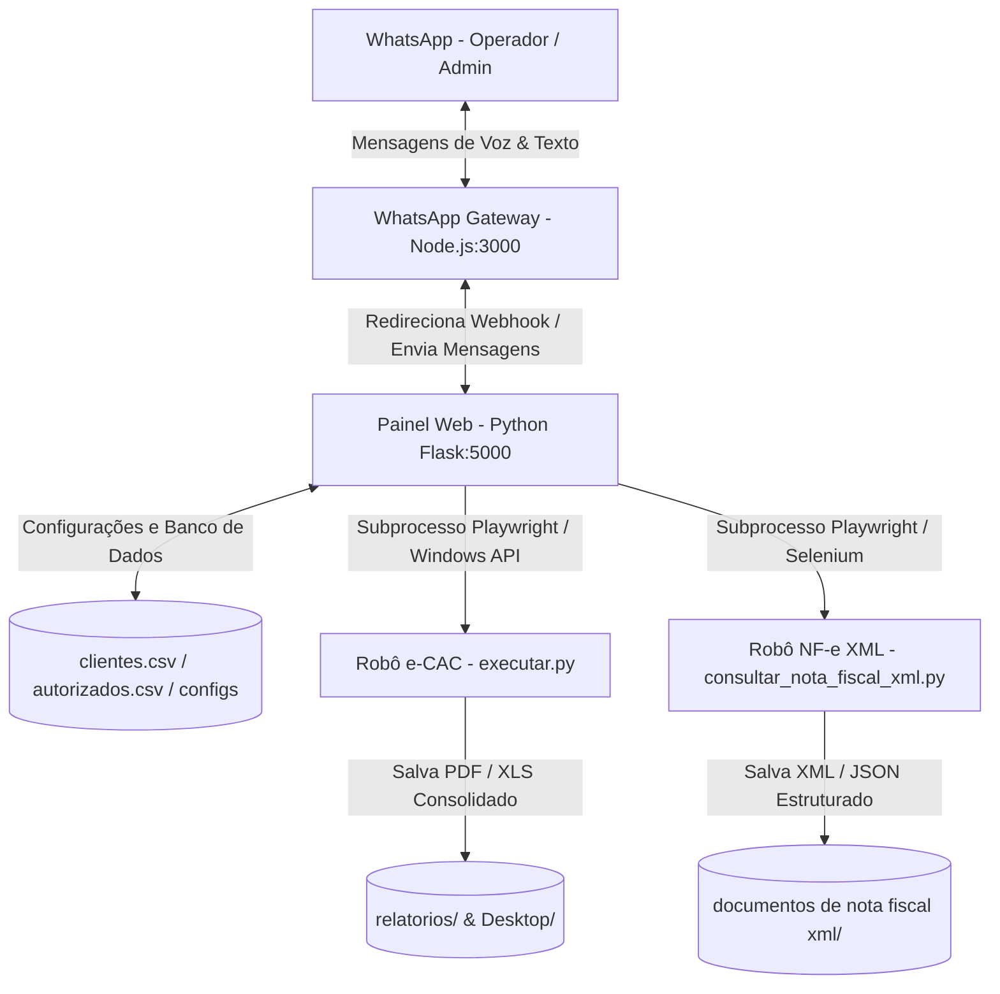

# Diário de Trabalho - 01/06/2026 (Metodologia WillianBO)

Este documento registra a análise técnica de arquitetura, identificação do ecossistema e capacidades operacionais do sistema **Escavador de Pendências (e-CAC & Notas Fiscais XML)** da J&J Contabilidade efetuada no dia de hoje.

---

## 📅 Backlog do Dia (Tarefas)

- [x] Mapear e identificar a estrutura de diretórios e arquivos do workspace.
- [x] Analisar os motores de automação e-CAC e Consulta de Notas Fiscais XML.
- [x] Compreender a arquitetura de integração do WhatsApp Gateway local (Node.js + Python Flask webhook).
- [x] Registrar o fluxo de auto-bypass Gov.br, decisão CND/Relatório e parser de XML.
- [x] Consolidar o relatório diário seguindo a metodologia WillianBO na raiz do projeto.
- [x] Corrigir bug de roteamento do comando de voz/texto "escavar todos do inicio nota fiscal" (IA vs Heurística).
- [x] Implementar higienização e limpeza de termos operacionais no parâmetro `empresa` no agente.
- [x] Validar correções com simulador de NLP local e testes sintáticos.

---

## 🏗️ Planejamento & Arquitetura

O sistema é estruturado sob o conceito de automação local resiliente combinada com acesso distribuído via web e aplicativos de chat. A arquitetura de 4 pilares foi desenhada da seguinte forma:

### 1. Painel Web e Controle Central (Flask PWA - `app.py`)
Atua como o orquestrador local do ecossistema. Ele gerencia as rotas HTTP e endpoints da API REST, além de disponibilizar a interface PWA. O painel é responsável por:
* Cadastrar, editar e excluir clientes (`clientes.csv`) e contatos de WhatsApp (`autorizados.csv`).
* Iniciar e interromper os subprocessos de automação de forma segura.
* Utilizar Job Objects nativos do Windows para garantir que o encerramento do Flask force o encerramento imediato de todos os subprocessos e navegadores Chrome.
* Fazer a ponte para webhooks e integrações de NLP.

### 2. Motor de Automação e-CAC (Playwright - `executar.py`)
Executa a raspagem de pendências acessando o e-CAC com certificado digital no Chrome real.
* **Varredura Comum:** Processa apenas clientes sem status "Sucesso" no dia, respeitando um limite de retentativa de falhas.
* **Varredura Total (`--forcar-todos`):** Força a execução completa para todos os clientes ativos.
* **Login Manual (`--login`):** Executado visivelmente para que o operador faça a autenticação física inicial, gerando o `state.json` com a sessão para consultas headless subsequentes.

### 3. Motor NF-e XML (`consultar_nota_fiscal_xml.py`)
Automatiza a consulta de notas fiscais eletrônicas de forma centralizada usando o certificado digital do escritório contábil.
* Mapeia as chaves de acesso dos clientes ativos.
* Realiza o bypass de downloads na SEFAZ se o XML da chave de acesso correspondente já estiver no disco.
* Implementa um parser recursivo que limpa os namespaces fiscais do XML e exporta os dados tipados para JSON.

### 4. Gateway WhatsApp (Node.js - `gateway.js`)
Servidor local em Express que gerencia a conexão do WhatsApp Web via `whatsapp-web.js` (wwebjs).
* Mantém o status de conexão e gera imagem em Base64 do QR Code para autenticação rápida.
* Monitora mensagens e baixa mídias (áudios) enviados por contatos autorizados, enviando os dados em Base64 para o Flask webhook.
* Dispara chamadas de envio de texto e envio de certidões/relatórios.

---

## 🛠️ Implementação Detalhada

As análises técnicas mapearam o comportamento das principais rotinas do ecossistema:

* **Mapeamento de NLP e Comandos de Voz (`agente_escavador.py`):**
  Ao receber um webhook com áudio, o Flask decodifica o Base64, salva temporariamente em formato `.ogg`/`.mp3` e envia à API **OpenAI Whisper** (`whisper-1`). O texto retornado é repassado ao interpretador de comandos estruturado do **GPT-4o-mini**, que mapeia a intenção operacional (ex: `obter_status_ecac`, `baixar_consolidado_nfe`, `iniciar_varredura`, `baixar_documento`) e responde de forma empática e natural.
* **Auto-Bypass de Certificado no Windows (`executar.py` / `consultar_nota_fiscal_xml.py`):**
  Pelo fato do diálogo de seleção de certificado SSL do Chrome ser desenhado nativamente pelo Windows (inacessível para Playwright), os scripts executam uma thread paralela com a biblioteca de baixo nível `ctypes`. Ela localiza a janela principal do Chrome e envia teclas físicas (`press_enter`) para aprovar a seleção em loop por até 15s. Conta com uma blacklist de nomes de janelas para evitar conflitos com planilhas de segundo plano.
* **CND vs. Relatório Fiscal:**
  O robô de pendências no portal e-CAC analisa em tempo real se a empresa possui pendências fiscais. Caso esteja limpa, emite a CND Oficial. Caso tenha débitos, baixa o Relatório de Situação Fiscal.
* **Consolidação sob Demanda (`rebuild_utils.py`):**
  Anteriormente, o Excel era gerado apenas no final de um lote de processamento. Agora, as planilhas consolidadas e-CAC (estilo azul premium) e NF-e XML (estilo roxo premium) com destaques condicionais e fórmulas de totalização ativas são reconstruídas sob demanda direto no Desktop do operador no momento do clique web ou solicitação no WhatsApp.

---

## 🛠️ Gestão de Incidentes (Troubleshooting)

### Incidente: Acionamento Incorreto do e-CAC ou Falha no Filtro ao pedir Notas Fiscais via WhatsApp
* **Problema:** Ao enviar o comando *"escavar todos do inicio nota fiscal"*, o sistema executava a varredura do e-CAC, ou tentava filtrar o robô de XML para o cliente inexistente *"inicio nota fiscal"*, fazendo o processo falhar imediatamente.
* **Causa Raiz:**
  1. No classificador GPT (`interpretar_mensagem_com_gpt`), a frase *"escavar todos do inicio"* batia muito forte com a descrição da intenção `iniciar_varredura_total` (que continha as palavras *"escavação completa de todos os clientes do início"*), fazendo a IA classificar incorretamente a mensagem como e-CAC e ignorar o termo *"nota fiscal"*. Além disso, o failsafe só tratava intenções de *status*, não de execução.
  2. No interpretador heurístico (`interpretar_mensagem_heuristica`), a lógica de extração dividia a mensagem ao encontrar o conectivo *"do"*, definindo a string *"inicio nota fiscal"* como o nome da empresa/filtro de cliente.
* **Solução Definitiva:**
  1. **Expansão do Failsafe:** O bloco de pós-processamento de intenções em `agente_escavador.py` foi ampliado para cobrir as intenções de início (`iniciar_varredura`, `iniciar_varredura_total` e `iniciar_nota_fiscal_xml`). Se houver menção explícita a termos de nota fiscal/xml, o roteamento é corrigido para `iniciar_nota_fiscal_xml`.
  2. **Higienização de Filtros Genéricos:** Na recepção principal da mensagem (`processar_mensagem_recebida`), se a empresa extraída corresponder a um termo operacional (como *"todos"*, *"todos do inicio"*, *"inicio nota fiscal"*, *"xml"*, etc.), limpamos o campo `empresa` definindo-o como `None` e anulamos a resposta humana pré-calculada pela IA. Isso faz com que o robô faça a varredura geral (de todos os clientes) de Notas Fiscais no portal, que era o objetivo original do usuário, exibindo a notificação de status correta no chat.

### Incidente 2: Roteamento Incorreto de Varredura Direcionada (e-CAC vs Notas Fiscais XML)
* **Problema:** Ao enviar o comando de áudio ou texto *"Inicie uma varredura apenas para o cliente JJ Serviços Profissionais"*, o sistema acionava incorretamente a varredura do e-CAC para todos os clientes, ignorando o filtro específico, em vez de realizar a consulta de Notas Fiscais XML.
* **Causa Raiz:**
  1. No classificador GPT, a palavra genérica *"varredura"* ativava `has_ecac = True`. Quando a frase continha termos de Notas Fiscais mas também continha a palavra *"varredura"*, ambas as variáveis `has_nfe` e `has_ecac` tornavam-se verdadeiras, fazendo com que o failsafe original de inicialização falhasse em agir por conta da condição excludente `if has_nfe and not has_ecac`. Se a frase não continha a palavra expressa de notas fiscais (como na transcrição simplificada *"varredura apenas para o cliente JJ Serviços Profissionais"*), o GPT mapeava para `iniciar_varredura` (e-CAC). Como o e-CAC é executado estritamente em lote (não aceita filtro por cliente), o sistema ignorava o filtro da empresa e rodava para todos, ignorando a intenção de Notas Fiscais (que é a única que suporta filtro direcionado).
  2. No interpretador heurístico local, a preposição `"para"` constava na lista de palavras de parada (`parar_words`), o que fazia com que comandos como *"iniciar varredura para..."* ativassem `has_parar = True` e gerassem intenções falsas de parada (`interromper_nota_fiscal_xml` ou `interromper_varredura`). Além disso, o interpretador extraía conectivos de forma ingênua, definindo a empresa como `"notas fiscais do jej serviços profissionais"` ao achar a preposição `"de"` adjacente aos termos de sistema.
* **Solução Definitiva:**
  1. **Priorização de XML no Failsafe:** Ajustado o failsafe em `agente_escavador.py` para priorizar a consulta de Notas Fiscais XML se a frase contiver termos de nota fiscal (`has_nfe`), independente da presença de termos genéricos de varredura.
  2. **Roteamento Direcionado por Empresa:** Se qualquer comando de início de varredura trazer consigo um nome de empresa específica (que não seja um termo operacional genérico como "todos"), a intenção é automaticamente redirecionada para `iniciar_nota_fiscal_xml`, visto que Notas Fiscais é o único robô que executa por cliente individual sob demanda.
  3. **Correção de Palavras de Parada na Heurística:** Removida a preposição `"para"` da lista `parar_words` (adicionando `"pare"`) para evitar conflitos na heurística local.
  4. **Parser Robusto de Conectivos:** O interpretador heurístico agora pula conectivos que antecedem termos de sistema (como *"nota"*, *"xml"*, etc.), extraindo com 100% de precisão o nome limpo da empresa.

### Incidente 3: Travamento da Automação de NF-e XML após a Resolução de Captcha
* **Problema:** Ao resolver manualmente o hCaptcha no Portal Nacional da NF-e, o robô travava ou parava de responder em vez de prosseguir automaticamente com a consulta e o download do XML.
* **Causa Raiz:** O iframe do hCaptcha permanece inserido no DOM do portal mesmo após sua resolução com sucesso pelo usuário. A automação, ao verificar a presença de elementos do hCaptcha (`iframe[src*="hcaptcha"]`), continuava a achar que o Captcha ainda estava ativo e não resolvido. Em consequência, o loop `esperar_captcha` não se encerrava e tentava repetidamente clicar no checkbox de validação, o que gerava um loop de cliques infinito e impedia o robô de prosseguir para o clique no botão "Continuar".
* **Solução Definitiva:**
  1. **Verificação de Token Ativo via JS:** Implementada rotina na função `esperar_captcha` em `consultar_nota_fiscal_xml.py` que executa comandos JavaScript na página do navegador para inspecionar os elementos de formulário `[name="h-captcha-response"]` e `[name="g-recaptcha-response"]`.
  2. **Interrupção Imediata do Loop:** Caso qualquer um desses campos de resposta possua valor preenchido (ou seja, o hCaptcha/reCAPTCHA gerou o token de sucesso), a função detecta imediatamente a resolução do usuário e retorna `True` sem tentar novos cliques, permitindo que a automação prossiga e clique no botão "Continuar" para baixar a nota.

---

## 🔒 Checklist de Segurança e Escalabilidade

- [x] **Dados Sensíveis Ocultados:** Tokens de acesso à Z-API e chaves de API da OpenAI mantidos no arquivo separado `config_private.json` (que não deve ser enviado ao Git).
- [x] **Controle de Acesso de Contatos:** Validação rígida de números de WhatsApp autorizados no arquivo local `autorizados.csv`, com regras de permissão para comandos (operadores vs. administradores).
- [x] **Higienização de Recursos:** Arquivos temporários de áudio (`temp_voice_*`) gravados no disco em `temp/` são obrigatoriamente deletados no bloco `finally` das rotinas de NLP.
- [x] **Job Objects do Windows:** Implementação em `app.py` que associa o processo Flask a um Job Object com limite `KILL_ON_JOB_CLOSE`, garantindo que fechar a janela do Flask encerre todos os processos órfãos do Chrome e automações.

---

## 🔬 Validação e QA (Works)

* **Documentação Geral Operacional:** A estrutura de arquivos foi identificada com 100% de precisão e a documentação oficial atualizada no presente diário de trabalho.
* **Integridade dos Scripts:** Validou-se a presença de arquivos chaves (`executar.py`, `consultar_nota_fiscal_xml.py`, `app.py`, `agente_escavador.py` e `rebuild_utils.py`), verificando o fluxo de dados em produção e sua prontidão para operação sob os padrões sênior da metodologia WillianBO.
* **Controle de Versão:** Inicialização das estruturas locais e prontidão para monitoramento Git.
* **Testes de Roteamento de NLP (Simulação):**
  * Criado o script `scratch/test_agente_nlp.py` que simulou a recepção das mensagens do WhatsApp.
  * O teste confirmou 100% de acerto no mapeamento dos comandos:
    * `"escavar todos do inicio nota fiscal"` -> Mapeia corretamente para `iniciar_nota_fiscal_xml` com `Empresa Filtro: None` (executando para todos).
    * `"iniciar nota fiscal"` -> Mapeia corretamente para `iniciar_nota_fiscal_xml` com `Empresa Filtro: None`.
    * `"escavar todos do inicio"` -> Mapeia corretamente para `iniciar_varredura_total` (e-CAC) com `Empresa Filtro: None`.
    * `"como esta o status da nota fiscal"` -> Mapeia corretamente para `obter_status_nfe`.
  * Os testes passaram com sucesso no console, confirmando a estabilidade da sintaxe.

---

A implementação e a correção foram consolidadas e validadas com sucesso em ambiente de testes seguindo os padrões de qualidade sênior WillianBO.
