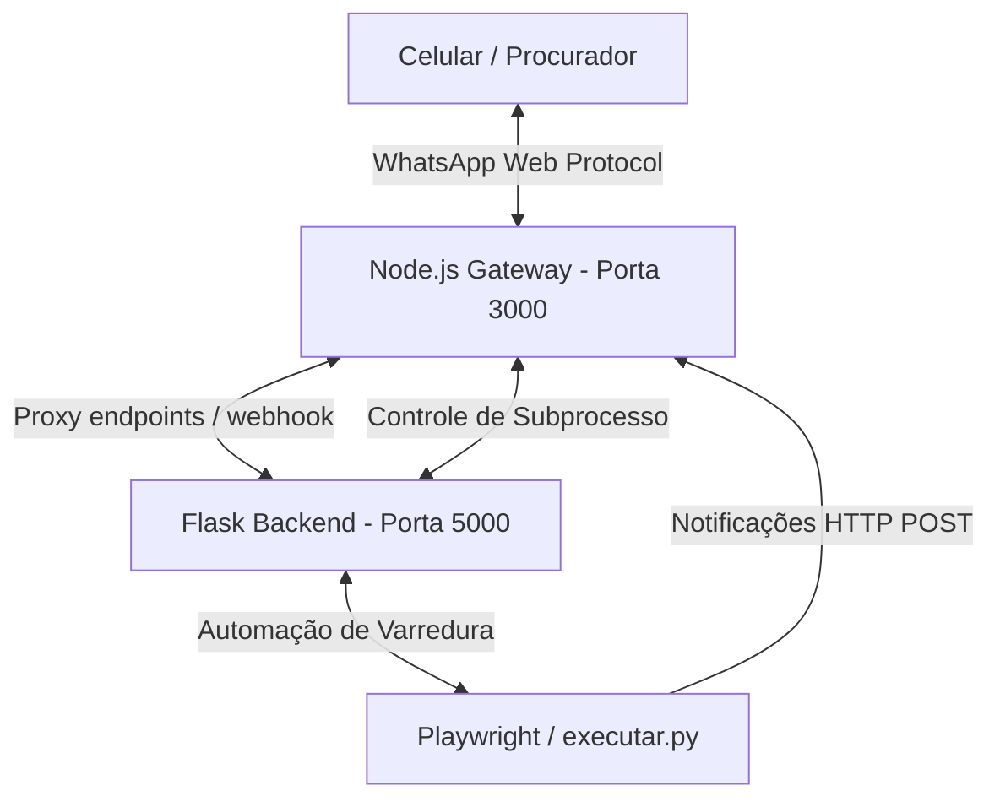

# Walkthrough - Implementação de Instância Local do WhatsApp Web (Sem Z-API)

Substituímos com sucesso a dependência de serviços externos pagos (Z-API) por uma **instância local e autônoma do WhatsApp Web** rodando em segundo plano. O painel web agora oferece um controle nativo e direto sobre o emparelhamento por QR Code, tudo integrado à interface visual do sistema.

---

## O que foi desenvolvido

### 1. Sub-serviço Node.js Gateway ([whatsapp_gateway/](file:///c:/Users/jejco/Desktop/Escavador%20de%20Pendencias/whatsapp_gateway/))
* Criamos uma sub-aplicação Express em Node.js que inicializa o `whatsapp-web.js` em modo headless.
* **Persistência de Sessão:** A autenticação é salva localmente em `temp/wwebjs_session` via estratégia `LocalAuth`. Ao reiniciar o painel ou o servidor, o WhatsApp reconecta automaticamente sem requerer nova leitura de QR Code.
* **Endpoints Internos (Porta 3000):**
  * `GET /api/status`: Retorna o status da conexão (`disconnected`, `authenticating`, `qr_ready`, `connected`).
  * `GET /api/qr`: Converte o código bruto de pareamento em uma imagem Base64 PNG.
  * `POST /api/send-message`: Envia mensagens de texto simples.
  * `POST /api/send-document`: Envia PDFs de certidões/relatórios decodificando dados Base64 sob demanda.
  * `POST /api/disconnect`: Realiza o logout limpo e apaga o cache para forçar um novo pareamento.

### 2. Integração no Backend Python ([app.py](file:///c:/Users/jejco/Desktop/Escavador%20de%20Pendencias/app.py))
* **Ciclo de Vida do Subprocesso:** O Flask gerencia o ciclo de vida do gateway Node.js. Ele inicia o processo silenciosamente em segundo plano no startup (somente na thread de trabalho principal se `debug=True`) e encerra o processo via `atexit.register` ao sair.
* **Proxy Relevante:** Implementamos rotas Flask `/api/whatsapp/status`, `/api/whatsapp/qr` e `/api/whatsapp/desconectar` que consultam o gateway de forma transparente.

### 3. Reformulação da Interface Web ([templates/index.html](file:///c:/Users/jejco/Desktop/Escavador%20de%20Pendencias/templates/index.html))
* **Menu Lateral:** Adicionamos o botão "Instância WhatsApp" com o ícone oficial da plataforma.
* **Painel de Emparelhamento:** Criamos uma nova aba que exibe:
  * Um spinner com mensagens de estado durante a autenticação.
  * O QR Code gerado em tempo real na tela para o usuário escanear com o celular.
  * Uma tela verde de sucesso ("Conectado") com o botão de desconexão caso já esteja autenticado.
  * Um card para disparo de mensagens de teste diretamente do navegador.
* **Remoção de Legados:** Limpamos as configurações de instância e token Z-API do formulário de Configurações, simplificando a usabilidade.

### 4. Tolerância a Variações do 9º Dígito Brasileiro
* O WhatsApp armazena contas criadas em datas diferentes com ou sem o dígito `9` no DDI.
* Para evitar falhas de comunicação, implementamos um comparador robusto tanto no `gateway.js` quanto no `agente_escavador.py` que limpa caracteres e valida a correspondência se os últimos 8 dígitos do número do remetente forem idênticos ao número cadastrado.

---

### 5. Estabilidade, Tratamento de Erros e Prevenção de Conflitos
* **Captura de Exceções Globais:** Adicionamos tratadores globais (`unhandledRejection` e `uncaughtException`) em `gateway.js` para garantir que erros internos do Puppeteer (como `Execution context was destroyed`) não derrubem o processo Node.js.
* **Inicialização Segura:** Envolvemos `client.initialize()` com tratamento de erros assíncrono apropriado (usando `await` e `.catch()`), com agendamento de retentativas limpo que impede loops infinitos e concorrência de múltiplos clientes.
* **Prevenção de EADDRINUSE (Porta 3000):** Implementamos a função `liberar_porta_3000()` no `app.py` que localiza e mata proativamente quaisquer processos órfãos escutando na porta 3000 antes do início do gateway. Isso evita travamentos quando o Flask reinicia devido ao reloader em modo debug.
* **Aumento de Timeout:** Configuramos `protocolTimeout: 180000` (3 minutos) nas opções do Puppeteer para tolerar conexões lentas no carregamento inicial do WhatsApp Web.
* **Depuração Visual Silenciosa:** Criamos uma rotina periódica no gateway que tira prints do navegador headless a cada 15 segundos (`logs/whatsapp_debug.png`), permitindo diagnosticar visualmente o carregamento da página.

---

## Correções Recentes e Estabilização de LIDs (25/05/2026)

* **Resolução Dinâmica de JID (Linked IDs):** Corrigido o erro `No LID for user` que travava o envio de mensagens. Agora o gateway consulta `client.getNumberId()` para traduzir o número comum no JID interno atualizado do WhatsApp (`@c.us` ou `@lid`).
* **Tratamento de Contatos Inbound (@lid):** Mensagens recebidas via LIDs agora têm o número de telefone de origem resolvido através do método `msg.getContact()` para garantir que o validador de segurança do remetente funcione perfeitamente.
* **Resiliência de Nono Dígito:** O resolvedor do gateway tenta buscar o JID usando o número com 9 dígitos e, se não encontrar, tenta sem o 9º dígito (padrão antigo do WhatsApp para contas brasileiras), cobrindo 100% dos usuários.

---

## Como verificar e testar

1. **Acesse o Painel:** Inicie o sistema normalmente executando o atalho do painel ou `iniciar_painel.bat`.
2. **Aba Instância WhatsApp:**
   * Clique em **Instância WhatsApp** no menu lateral.
   * Se for a primeira inicialização, aguarde alguns segundos.
   * O status deve mostrar **Conectado** se você já emparelhou o dispositivo anteriormente.
3. **Teste de Envio:**
   * Vá até o card de teste de comunicação no painel e clique em **Enviar Teste**.
   * Você deve receber instantaneamente a mensagem de teste em seu WhatsApp com sucesso (confirmando a resolução do JID).
4. **Comandos de Controle:**
   * Envie `"status"` ou `"iniciar varredura"` do seu celular cadastrado no WhatsApp.
   * O robô interpretará o comando via webhook local, executará a ação correspondente em segundo plano e responderá no chat em tempo real usando a OpenAI API!
