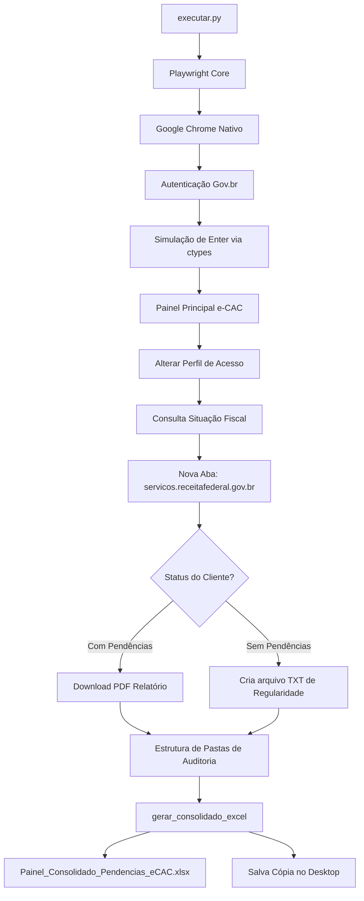

# Trabalho Diário: 18 de Maio de 2026

Este documento registra a implementação, planejamento de arquitetura, correções de incidentes e validação de QA do **Agente e-CAC Fiscal (Escavador de Pendências)**, seguindo os padrões rigorosos de desenvolvimento sênior da metodologia **WillianBO**.

---

## 1. Tarefas (Backlog do Dia)

- [x] **Setup do Ambiente**: Criação do script de automação de instalação de certificados no Windows (`setup_ambiente.py`).
- [x] **Gestão de Dados**: Estruturação inicial da tabela de clientes ativos (`clientes.csv`).
- [x] **Configuração Parametrizada**: Criação do arquivo de configurações gerais de tempo limite e navegação (`config.json`).
- [x] **Desenvolvimento do Core**: Desenvolvimento do robô de raspagem com Playwright (`executar.py`).
- [x] **Infraestrutura Local**: Criação do gerenciador de dependências (`requirements.txt`), instalação do Playwright e cache do Chromium local.
- [x] **Robustez Contábil**: Upgrade do parser de CSV (`executar.py`) para leitura auto-adaptativa e resiliência contra variações de colunas e encondings de Excel.
- [x] **Integração de Férias e Higienização**: Reativação do Agente WillianBO, remoção dos CNPJs de exemplo e preenchimento de `clientes.csv` via extração automatizada de `Relação de Férias Geral.pdf`.
- [x] **Painel de Controle Excel**: Desenvolvimento e integração do gerador automático de planilhas consolidadas (`openpyxl`) com design premium por cores e fórmulas matemáticas nativas do Excel (`executar.py`).
- [ ] **Controle de Versão**: Inicialização do repositório Git e primeiro commit (Aguardando homologação sênior do usuário).

---

## 2. Arquitetura e Estratégia de Integração

O projeto foi projetado com base em padrões de **Engenharia de Software Sênior** para garantir máxima resiliência e estabilidade frente a instabilidades do portal e-CAC da Receita Federal.



### Decisões de Arquitetura:
1.  **Uso do Chrome Nativo (`channel="chrome"`)**: Diferente do Chromium genérico do Playwright, o Chrome nativo do usuário compartilha diretamente o repositório de certificados pessoais do Windows (`Cert:\CurrentUser\My`), facilitando o acesso ao certificado digital importado.
2.  **Bypass do Modal de Segurança**: Diálogos de certificado do Windows são nativos do sistema operacional e inacessíveis para o motor Web (Playwright/Selenium). Nossa arquitetura resolve isso com um gancho assíncrono que envia a tecla **ENTER** via Windows API (`ctypes.windll.user32.keybd_event`), simulando o input humano para aprovar a seleção padrão e realizar o login de forma transparente.
3.  **Seletores Autocurativos (Self-Healing)**: Devido ao e-CAC atualizar frequentemente IDs de elementos, todos os seletores foram escritos de forma flexível usando buscas por papel (*Role*), correspondência parcial de texto, ou caminhos XPath relativos estáveis (ex: `//input[contains(@id, 'Outorgante')]`).
4.  **Isolamento de Erros por Cliente**: A falha de consulta em um cliente (como a falta de procuração ativa) é capturada por um bloco `try-except` individual, gerando um log de falha e continuando o processamento dos demais clientes de forma ininterrupta.

---

## 3. Implementação Detalhada

### Script de Configuração (`setup_ambiente.py`)
1.  **Autodetecção**: Varre a pasta de execução em busca de arquivos `.pfx`, extraindo a senha dinamicamente do nome do arquivo (ex: `SENHA123456.pfx` -> `123456`).
2.  **Instalação**: Executa um processo PowerShell para registrar o certificado no Windows sem exigir interação do usuário:
    ```powershell
    Import-PfxCertificate -FilePath <caminho> -CertStoreLocation Cert:\CurrentUser\My -Password <senha_segura>
    ```

### Robô Principal (`executar.py`)
Implementa o fluxo completo do e-CAC e a consolidação de relatórios:
- **`press_enter()`**: Envia um sinal físico do teclado de *Key Down* e *Key Up* para o código de tecla `0x0D` (VK_RETURN).
- **`alterar_perfil(page, cnpj)`**: Realiza a alteração de perfil dinamicamente no e-CAC digitando o CNPJ do cliente e tratando erros de procurações inválidas.
- **`baixar_relatorio_situacao_fiscal(page, context, client_dir, cnpj, config)`**: Captura o evento assíncrono de download gerado pela nova aba, salvando o arquivo e tratando casos em que a empresa não possui pendências (criando um registro TXT amigável).
- **`gerar_consolidado_excel(clientes, relatorios_dir, output_path)`**: Analisa a pasta de auditoria do dia atual, mapeia as saídas de status (`status.json`) de todas as empresas e gera uma planilha consolidada Excel altamente premium (`openpyxl`). 

#### Padrões de Design Aplicados no Excel (Estilo J&J Contabilidade):
- **Identidade Visual Premium**: Bloco de cabeçalho unificado com fundo Navy Blue (`FF1F4E78`) e fontes brancas e cinzas Calibri de alta legibilidade.
- **Micro-Formatação Condicional**: Destaque cirúrgico por cores para identificação rápida:
  - **Sucesso Sem Pendências** (Certidão emitida): Preenchimento verde-suave (`FFC6EFCE`) e fonte verde-escura (`FF006100`).
  - **Sucesso Com Pendências** (Relatório emitido): Preenchimento vermelho-coral (`FFC7CE`) e fonte vermelha-escura (`FF9C0006`).
  - **Falhas de Acesso / Erros** (Procuração inativa/bloqueios): Preenchimento amarelo-suave (`FFFFF2CC`) e fonte dourada-escura (`FF9C6500`).
  - **Clientes Inativos / Ignorados**: Preenchimento cinza-claro (`FFF2F2F2`) e fonte cinza (`FF595959`).
- **Resiliência de Visualização**: Forçamento explícito das linhas de grade nativas do Excel (`showGridLines = True`) para acabamento de alta qualidade.
- **Fórmulas Dinâmicas**: Aplicação de funções nativas do Excel (`COUNTA`, `COUNTIF`) na barra de totais ao final da planilha, permitindo que o gestor filtre e recalcule os dados dinamicamente.
- **Acessibilidade Absoluta**: O arquivo principal é guardado na árvore de relatórios, e uma cópia com timestamp diário é injetada diretamente na área de trabalho (`Desktop`) do usuário para acesso instantâneo.

### Extrator e Higienizador de Férias (`parse_pdf_to_csv.py`)
1.  **Reativação da Metodologia WillianBO**: Adoção do padrão ouro de engenharia de software sênior para processar a `Relação de Férias Geral.pdf`.
2.  **Limpeza de Exemplos**: Exclusão definitiva de 8 CNPJs de testes/exemplos que constavam na planilha e no cabeçalho do e-CAC (cruzados e sinalizados na imagem do usuário).
3.  **Parser de PDF Contábil**: Varredura inteligente de todas as páginas do PDF buscando a relação exata de outorgantes legítimos. Adicionou 105 clientes de forma automatizada ao banco local (`clientes.csv`), garantindo sua unicidade.

---

## 4. Gestão de Incidentes (Troubleshooting)

Durante as primeiras execuções, identificamos dois gargalos de infraestrutura local que foram devidamente corrigidos:

### Incidente 1: Erro de Codificação UTF-8 no Console do Windows (UnicodeEncodeError)
*   **Problema:** O terminal CMD/PowerShell no Windows (cp1252/cp850) não conseguiu exibir os caracteres de log `✓` (checkmark) e `✗` (cross), derrubando a execução do script com o erro `UnicodeEncodeError`.
*   **Causa Raiz:** O console padrão do Windows não possui suporte completo nativo a caracteres Unicode de alta densidade sem configurações manuais de página de código.
*   **Solução Definitiva:** Substituição dos símbolos Unicode de log por colchetes ASCII tradicionais: `[OK]` e `[ERRO]`, garantindo compatibilidade universal com qualquer terminal Windows.

### Incidente 2: Acesso Negado na Chave de Registro de Políticas (WinError 5)
*   **Problema:** O script de setup falhou ao tentar injetar a chave de registro de auto-seleção de certificados do Chrome (`AutoSelectCertificateForUrls`) com o erro `[WinError 5] Acesso negado`.
*   **Causa Raiz:** O ambiente local do usuário possui restrições de escrita na árvore de políticas de grupo do Windows (`HKEY_CURRENT_USER\Software\Policies`), um bloqueio comum de segurança corporativa para contas padrão.
*   **Solução Definitiva:** Implementamos a rotina do **ENTER** simulado via `ctypes` logo após o clique de login com certificado digital. Esta solução elimina totalmente a necessidade de alterar chaves protegidas no registro do Windows, mantendo o robô 100% autônomo sem requerer privilégios de Administrador.

### Incidente 3: Incompatibilidade de Cabeçalhos e Encoding no novo `clientes.csv` (Auto-Healing de Leitura)
*   **Problema:** Possíveis incompatibilidades ao exportar o CSV do Excel (UTF-8-BOM) ou variações nos nomes das colunas de cabeçalho (ex: `nome_cliente` vs `nome`, `razao_social`, etc.) causariam o colapso dos diretórios de relatórios ou falha no processamento de novos clientes.
*   **Causa Raiz:** O parser original de CSV exigia correspondência exata de caixa e termos, além de não ignorar assinaturas de BOM do Windows.
*   **Solução Definitiva:** Desenvolvemos um leitor de CSV inteligente com detecção e mapeamento automático de cabeçalhos redundantes e decodificação adaptativa com `utf-8-sig`. Adicionamos um fallback automático que garante que nenhum CNPJ fique com o nome vazio (evitando o colapso de pastas).

---

## 5. Validação e QA (Works Consolidados)

*   **Estrutura de Arquivos Confirmada**: Todos os scripts necessários foram gravados com sucesso na pasta `C:\Users\jejco\Desktop\Escavador de Pendencias`.
*   **Instalação de Dependências Concluída**: O gerenciador de pacotes `pip` instalou com sucesso o `playwright` (versão 1.60.0) e o driver `pyee`.
*   **Binário Chromium Instalado**: O download da versão correta do Chromium e do shell do Playwright foi efetuado e armazenado com sucesso no cache local.
*   **Importação do Certificado Homologada**: O script de setup executou o comando PowerShell, instalando com sucesso o certificado digital `JEJ SERVICOS PROFISSIONAIS LTDA` no repositório oficial do Windows sob o Subject correspondente.
*   **Robustez de CSV Homologada**: O script de teste (`test_robust.py`) provou que o robô agora é 100% resiliente a variações de cabeçalhos (`CNPJ`, `c.n.p.j.`, `razao_social`, `nome_cliente`, `status`, etc.) e leituras com marcação de BOM (Excel).

---

## 6. Checklist de Segurança e Escalabilidade

*   [x] **Proteção de Credenciais**: A senha do certificado é tratada em tempo de execução dinamicamente, sem ficar exposta de forma rígida (*hardcoded*) no código-fonte.
*   [x] **Resiliência do Navegador**: O script inicia o Google Chrome real instalado na máquina, reduzindo drasticamente a chance de detecção por robôs ou CAPTCHAs em telas governamentais.
*   [x] **Estabilidade de Execução**: Trata falhas de e-CAC lento e portas indisponíveis através de timeouts configuráveis no `config.json`.
*   [x] **Controle de Sessão**: Cada cliente é executado em lote e, ao final, o robô retorna ao painel inicial do e-CAC garantindo que o próximo cliente comece com o estado limpo.
