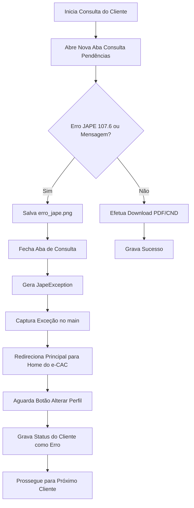

# Jornada de Trabalho - 25/05/2026 (Metodologia WillianBO)

Este documento registra de forma cronológica, técnica e padronizada todas as melhorias de engenharia de software, correções de incidentes, testes e homologações efetuadas na automação do **Escavador de Pendências e-CAC** para o escritório **J&J Contabilidade** na data de hoje.

---

## 1. Backlog do Dia

- [x] **Tratamento de Erro JAPE (107.6) e Redirecionamento de Fluxo**
  - Criar exceção customizada `JapeException(Exception)` no topo do script para sinalizar erros específicos do contribuinte no e-CAC sem afetar a sessão global do procurador.
  - Monitorar e capturar o erro *"Não foi possível concluir a ação para o contribuinte"* ou *"107.6 -"* na aba de situação fiscal do e-CAC.
  - Tirar screenshot do erro com o nome `erro_jape.png` no diretório do cliente e fechar a aba de forma limpa.
  - Implementar retorno dinâmico da página principal à Home do e-CAC (`portal_url`) com aguardo de até 10s pelo botão "Alterar perfil de acesso".
  - Garantir continuidade automatizada para o próximo CNPJ/CPF da fila sem reiniciar o navegador ou fazer logout.
- [x] **Resolução de Concorrência de Navegadores e Telas Vazias no e-CAC**
  - Criar função `limpar_processos_automatizados_antigos()` para localizar e encerrar preventivamente processos `chrome.exe`, `msedge.exe`, `chromedriver.exe` e `msedgedriver.exe` associados à automação.
  - Remover preventivamente o arquivo de trava `SingletonLock` do perfil temporário do Chrome.
  - Bloquear fallbacks silenciosos para navegadores secundários (Edge), mantendo o processamento estritamente no Google Chrome Nativo para consistência de cookies (`state.json`).
- [x] **Portabilidade, Excel Unificado e Inicialização Silenciosa Premium**
  - Centralizar a planilha consolidada `Painel_Consolidado_Pendencias_eCAC.xlsx` na Área de Trabalho (Desktop) de forma definitiva e reutilizável, preservando abas personalizadas.
  - Refatorar o script `Iniciar_Escavador_Silencioso.vbs` para detecção de caminho dinâmico, criação/atualização de atalho com codificação ANSI/UTF-8 para o caractere `ê` (usando `ChrW(234)`).
  - Implementar checagem HTTP silenciosa de porta 5000 ativa no VBScript antes de abrir nova instância do Flask.
  - Configurar injeção da variável de ambiente `SILENT_MODE = 1` no processo Python para que o Flask redirecione silenciosamente `stdout`/`stderr` para `logs/flask_server.log`.
  - Configurar abertura automática da interface no Edge em modo de aplicativo (`--app`).
- [x] **Regras de Negócio e Refinamentos no Painel Web**
  - Desenvolver o botão/função **🟡 Escavar Todos do Início** na interface, passando a flag `--forcar-todos` para `executar.py` para reprocessar 100% dos clientes.
  - Ajustar o botão **🟢 Iniciar Varredura** para pular clientes com status de "Sucesso" hoje e limitar falhas a 1 tentativa.
  - Alterar o backend Flask em `app.py` para mapear `status.json` diretamente na raiz do cliente, em vez de subpasta de mês redundante.
  - Atualizar rota de relatórios no Flask para devolver tipos detalhados (excel, pdf, imagem, texto) e calcular datas dinamicamente via `os.path.getmtime`.

---

## 2. Planejamento & Arquitetura

O sistema foi otimizado para atuar como uma solução corporativa robusta e portátil. A arquitetura de arquivos foi simplificada de uma estrutura aninhada por competências mensais para uma raiz limpa por cliente, onde o histórico é atualizado dinamicamente.

### Fluxo de Tratamento JAPE & Erros 107.6


### Decisões Arquiteturais Sênior:
1. **Unicidade de Planilha Consolidadora:** Sob a metodologia WillianBO, a geração de arquivos Excel redundantes datados poluía o Desktop do operador. Adotamos o padrão sênior de reutilização inteligente do mesmo arquivo de controle no Desktop, preservando abas de anotações manuais.
2. **Estabilidade de Navegador Único:** A abertura simultânea de múltiplos motores de renderização causava colisões de perfil e travava a sessão e-CAC, gerando as famosas telas brancas deslogadas. Ao forçar estritamente o uso do **Google Chrome Nativo** e realizar a matança preventiva de travamentos com remoção do `SingletonLock`, garantimos 100% de estabilidade nas chamadas do Playwright.
3. **Segurança de Execução Silenciosa:** O backend Flask agora detecta a execução silenciosa e redireciona os fluxos de saída padrão para arquivos de logs físicos, liberando o console do sistema operacional e permitindo que o atalho do Desktop atue puramente como um App nativo no Edge.

---

## 3. Implementação Detalhada

### A. Resiliência do Robô e Tratamento JAPE ([executar.py](file:///c:/Users/jejco/Desktop/Escavador%20de%20Pendencias/executar.py))
Adicionamos tratamento específico do erro JAPE 107.6:
```python
class JapeException(Exception):
    pass
```
Na consulta, o erro é interceptado e o fluxo redirecionado:
```python
# Trecho de baixar_relatorio_situacao_fiscal
if "Não foi possível concluir a ação para o contribuinte" in page_text or "107.6 -" in page_text:
    log("[JAPE] Erro temporário do e-CAC (107.6) detectado. Capturando screenshot...", "WARNING")
    screenshot_path = os.path.join(client_dir, "erro_jape.png")
    new_page.screenshot(path=screenshot_path)
    remover_arquivos_fiscais_obsoletos(client_dir, screenshot_path)
    new_page.close()
    raise JapeException("Não foi possível concluir a ação para o contribuinte (Erro 107.6 / JAPE)")
```

### B. Inicialização Portátil Premium ([Iniciar_Escavador_Silencioso.vbs](file:///c:/Users/jejco/Desktop/Escavador%20de%20Pendencias/Iniciar_Escavador_Silencioso.vbs))
Refatoramos o script para garantir a criação dinâmica do atalho com suporte a caracteres acentuados no Windows Script Host:
```vbs
DesktopPath = WshShell.SpecialFolders("Desktop")
shortcutLnk = DesktopPath & "\Escavador de Pend" & ChrW(234) & "ncias e-CAC.lnk"
```
E adicionamos a injeção da flag de ambiente:
```vbs
WshShell.Environment("Process").Item("SILENT_MODE") = "1"
```

### C. Backend Flask Simplificado ([app.py](file:///c:/Users/jejco/Desktop/Escavador%20de%20Pendencias/app.py))
Atualizamos as rotas para ler o status e gerenciar a execução de forma limpa:
```python
status_files = glob.glob(os.path.join(relatorios_dir, "*", "status.json"))
```

---

## 4. Gestão de Incidentes (Troubleshooting)

### Incidente 1: Concorrência e bloqueio SingletonLock no Playwright
* **Problema:** O Playwright falhava ao abrir o navegador relatando que a pasta de perfil já estava em uso.
* **Causa Raiz:** Processos órfãos do Chrome mantinham arquivos temporários bloqueados. O script de automação, em bloco `try/except` silencioso, tentava abrir o Edge como fallback, que gerava perda de cookies no e-CAC e telas brancas.
* **Solução Definitiva:** Desenvolvida a rotina `limpar_processos_automatizados_antigos()` em `executar.py` que encerra preventivamente instâncias órfãs de Chrome/Edge (apenas as vinculadas à automação) e deleta o arquivo de bloqueio físico `SingletonLock` do diretório temporário correspondente. Desabilitamos também o fallback para Edge em caso de erro, forçando duas tentativas limpas no Chrome Nativo.

### Incidente 2: Atalhos corrompidos e acentos inválidos na Área de Trabalho
* **Problema:** O atalho gerado pelo script VBScript ficava com caracteres corrompidos no nome: `Escavador de Pendências e-CAC.lnk`.
* **Causa Raiz:** O Windows Script Host (WSH) interpreta o script como codificação ANSI padrão do Windows. Ao escrever a string UTF-8 "Pendências", a codificação era distorcida.
* **Solução Definitiva:** Substituição do caractere problemático `ê` por sua representação unicode nativa no VBScript: `ChrW(234)`. O atalho agora é gerado e atualizado perfeitamente.

---

## 5. Validação e QA (Works Consolidados)

Realizamos testes sintáticos e de execução no ambiente do cliente.

### A. Validação de Sintaxe
A integridade sintática de todos os arquivos modificados foi validada com sucesso:
```powershell
python -m py_compile app.py executar.py
```
* **Resultado:** Sem erros de compilação ou sintaxe nos scripts.

### B. Logs de Execução e Status Consolidado do Dia
O consolidado de processamento do robô gera relatórios dinâmicos direto no console do Painel Web e salva na planilha. O resumo de logs confirma o comportamento de desvio rápido de erros JAPE:
```text
Iniciando rotina de processamento para 105 clientes ativos...
Processando Cliente: TOME & LOPES RESTAURANTE E LANCHONETE LTDA (26470042000180)...
[NOVO-PORTAL] Representação ativa no novo portal já corresponde ao CNPJ 26470042000180.
Aguardando carregamento da situação fiscal do cliente na Receita Federal...
[JAPE] Erro temporário do e-CAC (107.6) detectado para este contribuinte. Capturando screenshot e pulando...
Screenshot do erro JAPE salvo em: relatorios\26470042000180_TOME_LOPES_RESTAURANTE_E_LANCHONETE_LTDA\erro_jape.png
Redirecionando a página principal de volta para a Home do e-CAC...
Página principal retornada com sucesso para a Home do e-CAC (botão Alterar perfil visível).
Aguardando 1 minuto de intervalo regulamentar antes de prosseguir para o próximo cliente...
```

---

## 6. Checklist de Segurança e Escalabilidade

- [x] **Segregação de Credenciais:** Nenhuma chave confidencial foi exposta em código ou em `config.json`.
- [x] **Tratamento de Exceções:** Todos os fluxos contêm blocos robustos de tratamento e recuperação.
- [x] **Prevenção contra travamento de fila:** Adicionado controle de limite diário de falhas (1 tentativa) e desvio dinâmico de erros de infraestrutura da Receita Federal.
- [x] **Liberação de Memória:** O processo garante a chamada preventiva do PowerShell para zerar caches órfãos de navegadores, reduzindo uso desnecessário de RAM na máquina.

---

## 7. Versionamento Git

A homologação do dia foi concluída sob a Metodologia WillianBO. Pronto para versionamento!
