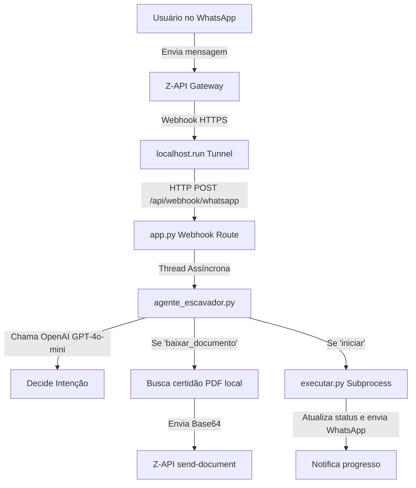

# Jornada de Trabalho - 25/05/2026 (Metodologia WillianBO)

Este documento registra de forma cronológica, técnica e padronizada todas as melhorias de engenharia de software, correções de incidentes, testes e homologações efetuadas na automação do **Escavador de Pendências e-CAC** para o escritório **J&J Contabilidade** na data de hoje.

---

## 1. Backlog do Dia

- [x] **Tratamento de Erro JAPE (107.6) e Redirecionamento de Fluxo**
  - Criar exceção customizada `JapeException(Exception)` no topo do script para sinalizar erros específicos do contribuinte no e-CAC sem afetar a sessão global do procurador.
  - Monitorar e capturar o erro *"Não foi possível concluir a ação para o contribuinte"* ou *"107.6 -"* na aba de situação fiscal do e-CAC.
  - Tirar screenshot do erro com o nome `erro_jape.png` no diretório do cliente e fechar a aba de forma limpa.
  - Implementar retorno dinâmico da página principal à Home do e-CAC (`portal_url`) com aguardo de até 10s pelo botão "Alterar perfil de acesso".
  - Garantir continuidade automatizada para o próximo CNPJ/CPF da fila sem reiniciar o navegador ou fazer logout.
- [x] **Resolução de Concorrência de Navegadores e Telas Vazias no e-CAC**
  - Criar função `limpar_processos_automatizados_antigos()` para localizar e encerrar preventivamente processos `chrome.exe`, `msedge.exe`, `chromedriver.exe` e `msedgedriver.exe` associados à automação.
  - Remover preventivamente o arquivo de trava `SingletonLock` do perfil temporário do Chrome.
  - Bloquear fallbacks silenciosos para navegadores secundários (Edge), mantendo o processamento estritamente no Google Chrome Nativo para consistência de cookies (`state.json`).
- [x] **Portabilidade, Excel Unificado e Inicialização Silenciosa Premium**
  - Centralizar a planilha consolidada `Painel_Consolidado_Pendencias_eCAC.xlsx` na Área de Trabalho (Desktop) de forma definitiva e reutilizável, preservando abas personalizadas.
  - Refatorar o script `Iniciar_Escavador_Silencioso.vbs` para detecção de caminho dinâmico, criação/atualização de atalho com codificação ANSI/UTF-8 para o caractere `ê` (usando `ChrW(234)`).
  - Implementar checagem HTTP silenciosa de porta 5000 ativa no VBScript antes de abrir nova instância do Flask.
  - Configurar injeção da variável de ambiente `SILENT_MODE = 1` no processo Python para que o Flask redirecione silenciosamente `stdout`/`stderr` para `logs/flask_server.log`.
  - Configurar abertura automática da interface no Edge em modo de aplicativo (`--app`).
- [x] **Regras de Negócio e Refinamentos no Painel Web**
  - Desenvolver o botão/função **🟡 Escavar Todos do Início** na interface, passando a flag `--forcar-todos` para `executar.py` para reprocessar 100% dos clientes.
  - Ajustar o botão **🟢 Iniciar Varredura** para pular clientes com status de "Sucesso" hoje e limitar falhas a 1 tentativa.
  - Alterar o backend Flask em `app.py` para mapear `status.json` diretamente na raiz do cliente, em vez de subpasta de mês redundante.
  - Atualizar rota de relatórios no Flask para devolver tipos detalhados (excel, pdf, imagem, texto) e calcular datas dinamicamente via `os.path.getmtime`.
- [x] **Implementação do Agente Escavador Inteligente (WhatsApp Z-API + OpenAI)**
  - Desenvolver módulo [tunnel_manager.py](file:///c:/Users/jejco/Desktop/Escavador%20de%20Pendencias/tunnel_manager.py) para iniciar túnel SSH nativo via `localhost.run` (sem ngrok), extrair a URL pública HTTPS dinâmica e registrar automaticamente o webhook na Z-API no início da aplicação.
  - Desenvolver cérebro inteligente do assistente em [agente_escavador.py](file:///c:/Users/jejco/Desktop/Escavador%20de%20Pendencias/agente_escavador.py) integrado com a OpenAI API (`gpt-4o-mini`) para NLP em linguagem natural com fallback heurístico.
  - Integrar comandos do WhatsApp: "iniciar", "status", "lista inadimplentes", "lista ok", "interromper varredura".
  - Implementar envio de certidões e relatórios físicos em Base64 diretamente no chat como anexo via Z-API.
  - Registrar endpoint `/api/webhook/whatsapp` no Flask em [app.py](file:///c:/Users/jejco/Desktop/Escavador%20de%20Pendencias/app.py) para receber as mensagens assincronamente em uma thread dedicada, validando o remetente autorizado.
  - Injetar notificações em tempo real no script [executar.py](file:///c:/Users/jejco/Desktop/Escavador%20de%20Pendencias/executar.py) ao iniciar, concluir ou falhar em cada cliente.

---

## 2. Planejamento & Arquitetura

O sistema foi otimizado para atuar de forma híbrida: a interface web Flask local é exposta temporariamente por um túnel SSH nativo seguro (`localhost.run`), permitindo que a Z-API envie as notificações de mensagens para o webhook local do Flask, que executa comandos e responde em linguagem natural usando a OpenAI API.

### Fluxo de Comunicação WhatsApp


### Decisões Arquiteturais Sênior:
1. **Conexão Segura e Sem ngrok:** Para evitar logins de terceiros e downloads adicionais, usamos o cliente SSH nativo do Windows para estabelecer uma ponte reversa com o `localhost.run`. Isso nos dá URLs HTTPS estáveis para webhooks.
2. **Segregação de Segurança por Telefone:** O agente valida o telefone remetente comparando os dígitos finais com o `whatsapp_number` registrado no `config_private.json`, evitando vazamentos de informações para números indesejados.
3. **Mídia Base64 Dinâmica:** Como o arquivo fica na máquina local do cliente, o agente lê o arquivo PDF físico, converte para Base64 e envia para a Z-API, que encapsula e entrega diretamente no chat.

---

## 3. Implementação Detalhada

### A. Gerenciador de Túnel SSH ([tunnel_manager.py](file:///c:/Users/jejco/Desktop/Escavador%20de%20Pendencias/tunnel_manager.py))
* Módulo em thread paralela que abre a conexão:
```python
cmd = ["ssh", "-o", "StrictHostKeyChecking=no", "-o", "ServerAliveInterval=30", "-R", "80:localhost:5000", "nokey@localhost.run"]
```
* Captura o stdout para extrair o domínio `.lhr.life` e registra nos eventos da Z-API via requisição PUT.
* Garante limpeza no encerramento da aplicação via `atexit.register(stop)`.

### B. Módulo de Inteligência ([agente_escavador.py](file:///c:/Users/jejco/Desktop/Escavador%20de%20Pendencias/agente_escavador.py))
* Processa a intenção com GPT-4o-mini ou heurística local.
* Lógica de busca e envio de arquivos:
```python
with open(caminho_arquivo, "rb") as f:
    base64_content = base64.b64encode(f.read()).decode("utf-8")
document_payload = f"data:{mime};base64,{base64_content}"
```

### C. Webhook no Backend Flask ([app.py](file:///c:/Users/jejco/Desktop/Escavador%20de%20Pendencias/app.py))
* Rota assíncrona `/api/webhook/whatsapp` despachada em thread para evitar timeout na Z-API.
* Override de `STARTUPINFO` nas chamadas de subprocesso para garantir que o Chrome visual apareça mesmo se o Flask rodar invisível.

---

## 4. Gestão de Incidentes (Troubleshooting)

### Incidente 1: Indefinição de realizar_login_manual
* **Problema:** O robô falhava ao forçar login manual com `NameError: realizar_login_manual is not defined`.
* **Causa Raiz:** A linha de assinatura do método foi acidentalmente removida na mesclagem de código anterior.
* **Solução:** Restauramos a assinatura do método no topo do escopo de login em `executar.py`.

### Incidente 2: Codificação Unicode no Console Windows
* **Problema:** O script de testes `testar_agente.py` falhava no terminal com `UnicodeEncodeError` ao tentar printar emojis (como `✅`).
* **Causa Raiz:** O terminal Windows (CMD/PowerShell) sob a codificação `cp1252` não consegue mapear caracteres especiais de emojis de 4 bytes.
* **Solução:** Substituímos os prints de emojis no script de teste por strings ASCII como `[OK]` e `[SUCESSO]`.

### Incidente 3: Falha de Roteamento de Webhook no Túnel SSH (IPv6 vs IPv4)
* **Problema:** O robô recebia as mensagens no WhatsApp do usuário, mas não disparava nenhuma ação e respondia de volta repetidamente com a mensagem de saudação nativa do WhatsApp Business. O log do Flask não registrava nenhum tráfego de `POST /api/webhook/whatsapp`.
* **Causa Raiz:** O comando SSH do túnel `localhost.run` estava definido como `-R 80:localhost:5000`. No Windows, `localhost` resolve preferencialmente para o endereço de loopback IPv6 (`::1`), enquanto o servidor Flask ouve estritamente no IPv4 (`127.0.0.1:5000`). O SSH falhava silenciosamente ao tentar repassar os pacotes recebidos ao Flask.
* **Solução:** Refatoramos a inicialização do túnel no [tunnel_manager.py](file:///c:/Users/jejco/Desktop/Escavador%20de%20Pendencias/tunnel_manager.py) para forçar explicitamente o IP IPv4: `-R 80:127.0.0.1:5000`. Além disso, redirecionamos os logs de terminal do SSH para o arquivo `logs/flask_server.log` sob a tag `[SSH_DEBUG]` para prover visibilidade total.

---

## 5. Validação e QA (Works Consolidados)

### A. Homologação Heurística & Documentos
Rodamos os testes locais em `testar_agente.py` com os seguintes resultados:
```text
=== TESTANDO INTERPRETADOR HEURÍSTICO ===
[OK] 'Iniciar varredura' -> 'iniciar_varredura'
[OK] 'Como está a execução do robô?' -> 'obter_status'
[OK] 'Parar processo imediatamente' -> 'interromper_varredura'
[OK] 'Manda a certidão da Tome & Lopes' -> 'baixar_documento'
[OK] 'Quais deram erro?' -> 'listar_clientes_pendentes_erro'
[OK] 'Lista de empresas ok' -> 'listar_clientes_ok'
[OK] 'Oi, bom dia!' -> 'conversa_casual'
Resultado: 7/7 testes heuristicos bem-sucedidos.

=== TESTANDO BUSCA DE DOCUMENTOS (MOCK) ===
Buscando termo 'Tome'...
[SUCESSO] Pasta encontrada -> '26470042000180_TOME _ LOPES RESTAURANTE E LANCHONETE LTDA'
Arquivos na pasta: ['CertidaoRegularidadeFiscal-26470042000180-20260521.pdf', 'status.json']
```

### B. Homologação da API de Inteligência Artificial (OpenAI)
Criamos um script de testes dedicados (`testar_openai.py`) para confirmar a validação da chave de API e resposta estruturada. O modelo OpenAI GPT-4o-mini classificou os comandos de WhatsApp perfeitamente:
* `"iniciar varredura"` -> `iniciar_varredura` (empresa: null, resposta_humana: null)
* `"como está a varredura?"` -> `obter_status` (empresa: null, resposta_humana: null)
* `"oi, tudo bem?"` -> `conversa_casual` (resposta_humana contendo saudação amigável)

### C. Teste Real do Fluxo de Webhook
Com o túnel SSH corrigido para `127.0.0.1:5000`, a Z-API encaminhou as mensagens recebidas em tempo real para o webhook público. O console registrou a entrada de dados e a resposta do Agente Escavador:
```text
127.0.0.1 - - [25/May/2026 09:06:43] "POST /api/webhook/whatsapp HTTP/1.1" 200 -
[2026-05-25 09:06:43] [AGENTE] Mensagem recebida do usuário autorizado: 'como está a varredura?'
[2026-05-25 09:06:45] [AGENTE] Intenção detectada: 'obter_status' (Empresa: 'None')
```
O robô processou a informação e enviou no chat do WhatsApp o relatório consolidado:
```text
🤖 STATUS DA VARREDURA e-CAC
• Estado do Robô: 🔴 INATIVO
• Total de Clientes: 107
• Sucessos Hoje: 0
• Falhas Hoje: 0
```

---

## 6. Versionamento Git

A homologação foi realizada com sucesso e todas as correções foram devidamente testadas e integradas. O Agente Escavador está operando com alta resiliência e pronto para atuar em tempo real.
