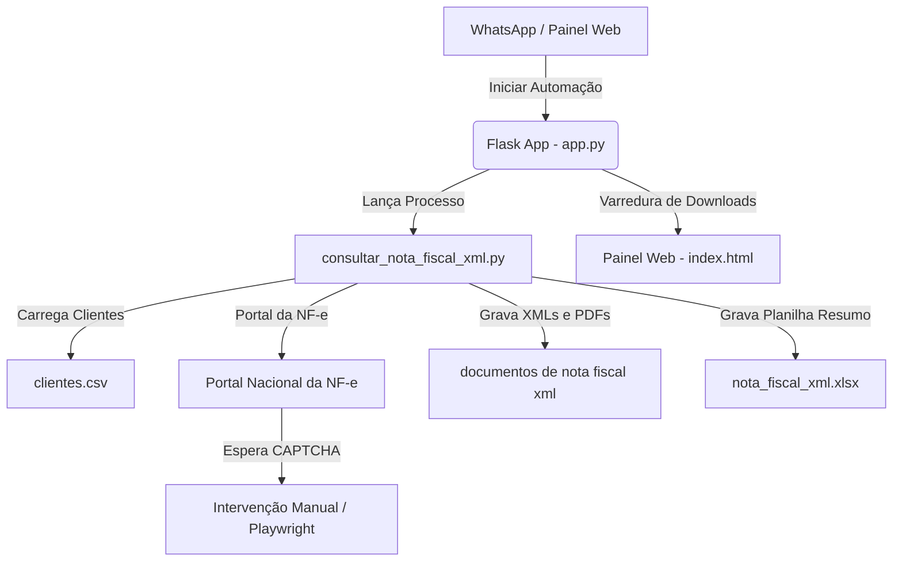

# Plano de Implementação: Automação e Painel de "Nota Fiscal XML"

Este plano descreve as alterações necessárias para renomear e reestruturar todas as referências da operação anterior ("Consulta de Inutilizações" / "Manifestação Destinatário") para **"Nota Fiscal XML"**. Isso abrange a atualização do script Playwright de automação, das rotas Flask no backend, do interpretador de comandos e fluxos do WhatsApp no agente, e de todos os componentes visuais, logs e relatórios da interface web.

---

## 🛠️ Nova Arquitetura e Fluxo de Arquivos

---

## Proposed Changes

### 1. Novo Script de Automação
#### [NEW] [consultar_nota_fiscal_xml.py](file:///c:/Users/jejco/Desktop/Escavador%20de%20Pendencias/consultar_nota_fiscal_xml.py)
* **Objetivo:** Criar o script final de automação a partir do `consultar_manifestacao.py`, adaptando todos os textos, logs, estados e caminhos para referenciar "Nota Fiscal XML".
* **Principais Alterações:**
  * Diretório de salvamento: `documentos de nota fiscal xml/{cnpj}_{nome_empresa}/`
  * Planilha de resumo local e cópia no Desktop: `nota_fiscal_xml.xlsx`
  * Logs do sistema: `logs/nota_fiscal_xml_{today}.log`
  * Arquivo de estado em tempo real: `temp/state_nota_fiscal_xml.json`
  * Título da aba da Planilha Excel: `"Nota Fiscal XML"`
  * Textos de alertas do WhatsApp em caso de CAPTCHA fazendo referência a "Nota Fiscal XML".

#### [DELETE] [consultar_manifestacao.py](file:///c:/Users/jejco/Desktop/Escavador%20de%20Pendencias/consultar_manifestacao.py)
* **Objetivo:** Remover o arquivo anterior para evitar duplicação ou confusão.

#### [DELETE] [consultar_inutilizacao.py](file:///c:/Users/jejco/Desktop/Escavador%20de%20Pendencias/consultar_inutilizacao.py)
* **Objetivo:** Remover o arquivo legado.

---

### 2. Backend Flask
#### [MODIFY] [app.py](file:///c:/Users/jejco/Desktop/Escavador%20de%20Pendencias/app.py)
* **Gerenciamento do Processo:**
  * Renomear a variável global `processo_inutilizacao` / `processo_manifestacao` para `processo_nota_fiscal_xml`.
  * Adaptar funções de inicialização e encerramento correspondentes.
* **Novas Rotas de API:**
  * `POST /api/nota_fiscal_xml/iniciar`: Inicia o processo `consultar_nota_fiscal_xml.py`.
  * `POST /api/nota_fiscal_xml/parar`: Encerra o processo ativo e força o fechamento do Chromium (`chrome_profile_nota_fiscal_xml`).
  * `GET /api/nota_fiscal_xml/status`: Retorna o status de execução lido de `temp/state_nota_fiscal_xml.json`.
* **Adaptação de Downloads e Listagem:**
  * Escanear a pasta `documentos de nota fiscal xml/` retornando os arquivos sob a categoria `nota_fiscal_xml`.
  * Adaptar o download de relatórios e a planilha consolidated para `nota_fiscal_xml.xlsx` (incluindo o arquivo na Área de Trabalho e localmente).

---

### 3. Agente do WhatsApp
#### [MODIFY] [agente_escavador.py](file:///c:/Users/jejco/Desktop/Escavador%20de%20Pendencias/agente_escavador.py)
* **Intenções de NLP (GPT / Heurística):**
  * Renomear as intenções `iniciar_inutilizacao` e `interromper_inutilizacao` para `iniciar_nota_fiscal_xml` e `interromper_nota_fiscal_xml`.
  * Atualizar o Prompt do sistema do GPT para ensinar as novas intenções e usar o termo "Nota Fiscal XML" em vez de "Inutilização" ou "Manifestação".
  * Atualizar o parser heurístico para capturar termos como `"xml"`, `"nota fiscal"`, `"nfe"`, `"notas"`.
* **Mensagens e Callbacks:**
  * Atualizar mensagens de resposta para o WhatsApp (ex: *"Estou iniciando a consulta de Notas Fiscais XML..."*).
  * Atualizar assinatura da função `processar_mensagem_recebida` para suportar `iniciar_xml_callback` e `parar_xml_callback`.

---

### 4. Interface Web (Painel de Controle)
#### [MODIFY] [index.html](file:///c:/Users/jejco/Desktop/Escavador%20de%20Pendencias/templates/index.html)
* **Estrutura da Página:**
  * Alterar o texto e o ícone do card de controle principal para **"Consulta de Notas Fiscais XML"**.
  * Alterar o botão da barra lateral/menu e abas de download para **"Notas Fiscais XML"** (IDs correspondentes alterados para `nota-fiscal-xml-downloads`).
  * Alterar a tabela de listagem de arquivos baixados na aba de Downloads para exibir a categoria com filtros específicos para "Notas Fiscais XML".
* **Código JavaScript:**
  * Renomear variáveis internas (ex: `listaRelatoriosInutilizacaoCache` -> `listaRelatoriosNotaFiscalXmlCache`).
  * Alterar as chamadas Ajax para as rotas `/api/nota_fiscal_xml/...`.
  * Atualizar monitoramento da barra de progresso lendo as chaves do novo estado `state_nota_fiscal_xml.json`.
  * Mudar a exibição de logs e os filtros de pesquisa de relatórios.

---

## Open Questions

> [!IMPORTANT]
> Nenhuma questão em aberto. Todas as premissas operacionais da consulta original foram mantidas (como a intervenção manual para o captcha no Portal da NF-e e a geração da planilha no Desktop do usuário), alterando-se apenas a nomenclatura pública e os caminhos de dados.

---

## Verification Plan

### Testes Manuais de Execução
1. **Verificação do Script:** Executar o script `consultar_nota_fiscal_xml.py` diretamente do console e certificar-se de que o navegador abre com o perfil isolado `chrome_profile_nota_fiscal_xml`, que o CNPJ é preenchido com a lógica de separação de campos, que o alerta de Captcha é disparado e que, após resolução, as chaves e os XMLs/PDFs são salvos na pasta `documentos de nota fiscal xml/`.
2. **Integração Backend/Frontend:** Acessar o painel web, testar o botão "Consultar Notas Fiscais XML", verificar o preenchimento em tempo real da barra de progresso e se os arquivos aparecem listados para download na aba de relatórios com o filtro correspondente.
3. **Comando WhatsApp:** Enviar a frase *"iniciar consulta de nota fiscal xml"* para o robô via WhatsApp e verificar se ele inicia a execução e responde corretamente.
